# 문제 1: remote[GitHub] empty repo 생성
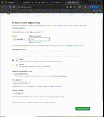

# 문제 2: git init & git push
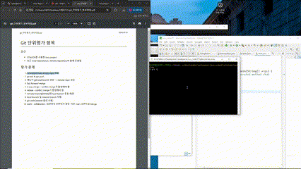

# 문제 3: 별도의 git local branch 생성 -> remote repo 생성

# 문제 4 :  fast forward merg
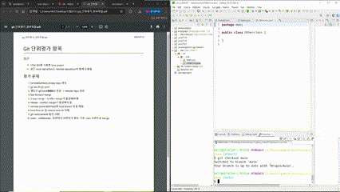

# 문제 5 :  3 way merge - conflict merge가 발생해야 함
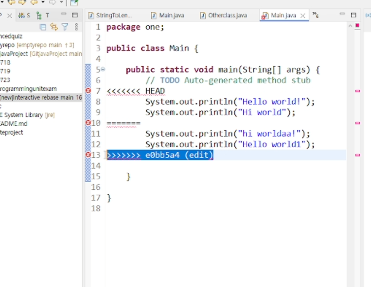

# 문제 6 : rebase - conflict merge가 발생해야 함
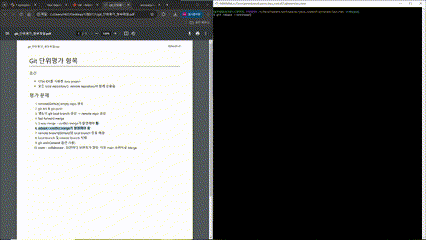

# 문제 7 : remote branch[GitHub]와 local branch 충돌 해결
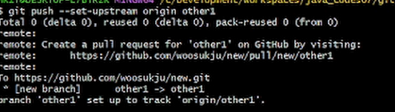
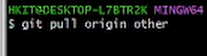

# 문제 8 : local branch 및 remote branch 삭제
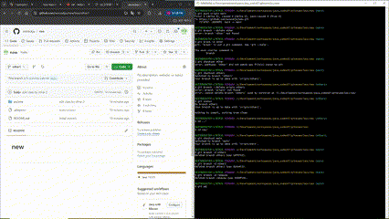

# 문제 9 : git undo[amend 옵션 사용]
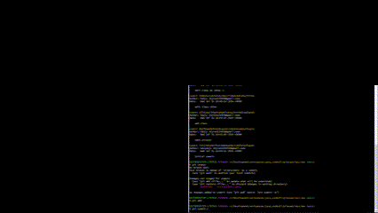

# 문제 10 :  team - collaborate : 팀원마다 브랜치가 할당. 이후 main 브랜치로 Merge
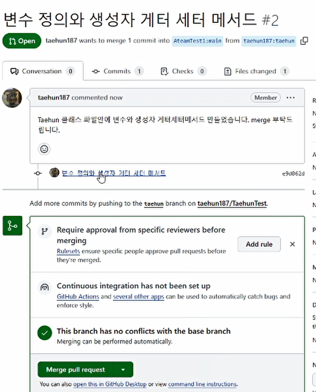
- merge pull request 클릭하여 머지
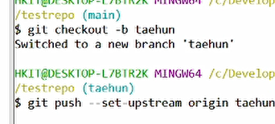
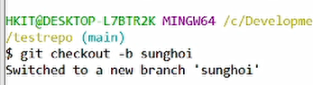
