# 1번
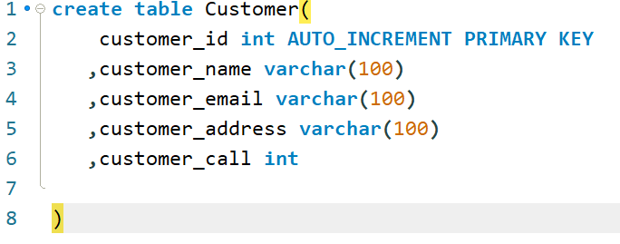
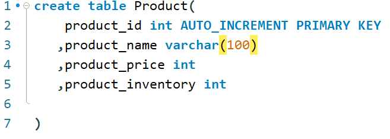
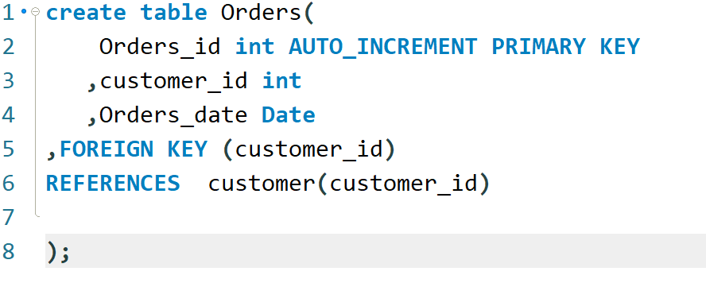
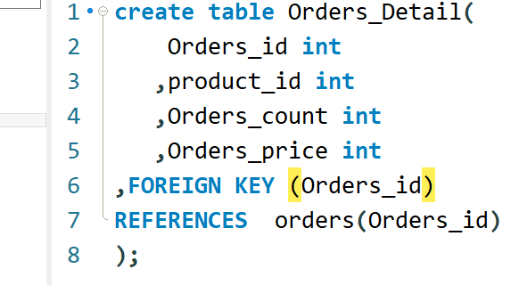

# 2번

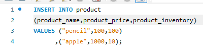
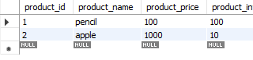
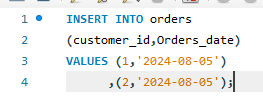
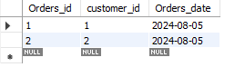

# 3번문제
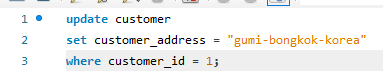

## 3번 문제 결과
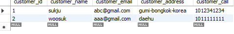
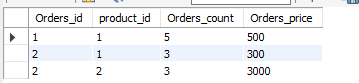

## 1번문제에서 외래키 1개를 덜 추가하여 추가로 외래키를 설정
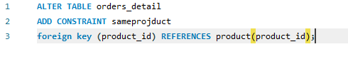

# 4번
## total price를 위해서 orders detail 의 값을 수정하였습니다  
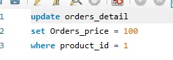
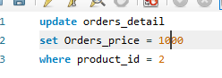
 update orders_detail
set Orders_price = 100
where product_id = 1

 update orders_detail
set Orders_price = 1000
where product_id = 2

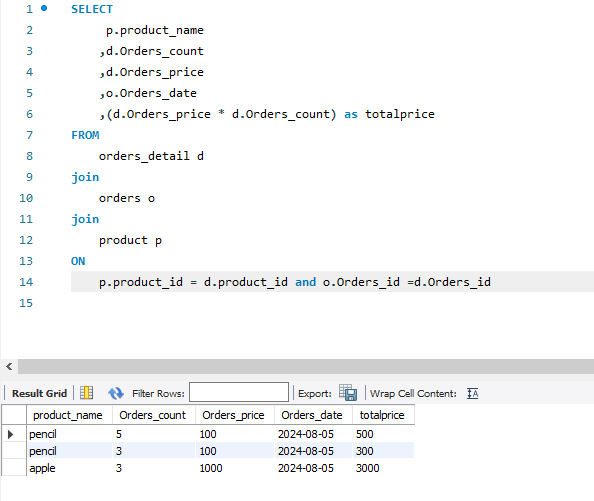

