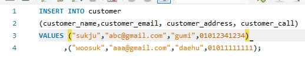

# 1번

# 2번

# 3번문제

## 3번 문제 결과

## 1번문제에서 외래키 1개를 덜 추가하여 추가로 외래키를 설정

# 4번
## total price를 위해서 orders detail 의 값을 수정하였습니다  

 update orders_detail
set Orders_price = 100
where product_id = 1

 update orders_detail
set Orders_price = 1000
where product_id = 2

